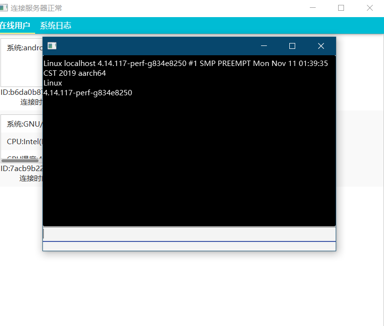
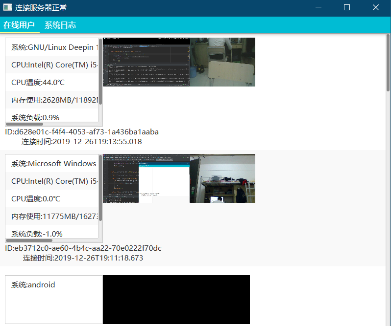
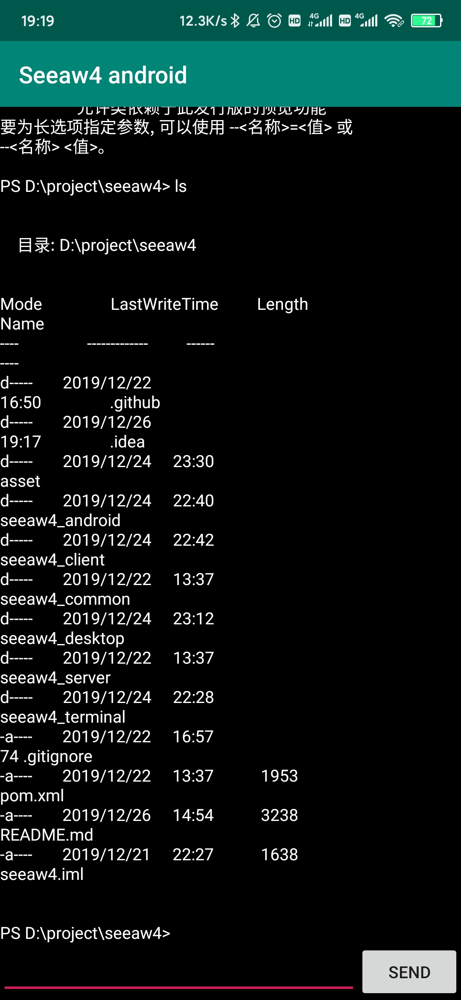
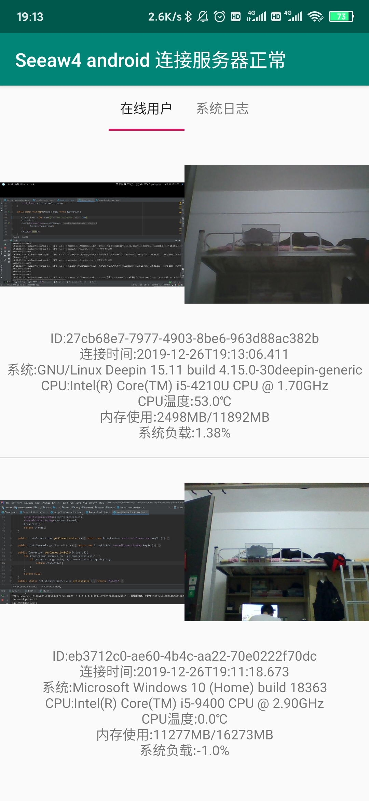

# SEEAW4

- see anywhere 4.0 version

新一代跨平台远程控制软件

## 背景

该项目起源我初学编程时的一个小demo

当时只是使用JAVA简单的IO 配合一些android编程，实现了一个可以从安卓手机远程查看电脑桌面的小程序
后来随着技术的不断学习，先后几次对项目进行了重写，也实现了诸如远程shell等功能

从单文件到丰富类层次结构再到实践设计模式，从BIO->NIO->再到netty
这期间接触到了一些工程化思想/方法，也积极地将这些思想/方法应用到实际开发中

从另一方面来说，这个项目也算是见证了我的学习历程

## 导航

之前的seeaw旧版本

- [seeaw](https://github.com/0xcaffebabe/seeaw)
- [seeaw3](https://github.com/0xcaffebabe/seeaw3-server-control)

## 主要功能

只要运行客户端，linux/win/mac/android都可以远程查看对方屏幕及摄像头还有一些系统信息
并且都能获取对方的一个远程shell进行操作

### 运行截图







## 模块

- common

一些通用类库以及一些接口定义

- server

服务端模块，负责处理客户端连接并能承受一定并发量，能独立打包运行部署

- client

客户端模块，连接服务端能独立运行并且可以与其他客户端连接通信

- desktop

构建一个跨平台(win,linux,osx)的桌面客户端程序，可以独立运行（该项目必须在JDK1.8下构建，如果使用的是openjdk，需要安装openjfx依赖）

- android

构建一个安卓客户端，功能同desktop

- web(暂时不实现)

提供一个web接口，能独立打包部署，可以通过该接口访问server

- terminal

可以集成到客户端，负责一些平台相关的远程控制功能

## 使用

你可以在seeaw4_server下的NettyConnector.java修改监听端口

```java
ChannelFuture sync = serverBootstrap.bind(1999).sync();
```

客户端Client类创建可以传入ip与端口，默认使用本地地址

执行构建

```shell script
mvn package
```

- 启动server

```shell script
java -jar ./seeaw4_server/target/seeaw4_server-1.0-SNAPSHOT-jar-with-dependencies.jar
```

控制台输出netty服务器启动成功则代表启动成功

- 启动client

```shell script
java -jar ./seeaw4_client/target/seeaw4_client-1.0-SNAPSHOT-jar-with-dependencies.jar
# 如果发现该终端到其他终端乱码，加上-Dfile,encoding=utf-8 参数
```

- 启动desktop端

```shell script
# 只能使用oracle jdk8 或 带有fx 的openjdk 启动 
java -jar ./seeaw4_desktop/target/seeaw4_desktop-1.0-SNAPSHOT-jar-with-dependencies.jar
```

- 安全认证

server,client,desktop端启动都可以指定-Dseeaw4.password=password参数来配置密码，该密码用来对客户认证以及消息传输加密，客户端与服务端使用的密码都相同。

android端，需要编程指定:

```java
PasswordService.update("password");
```


